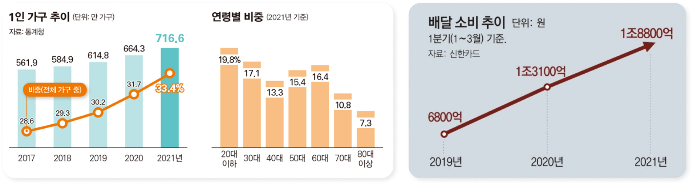
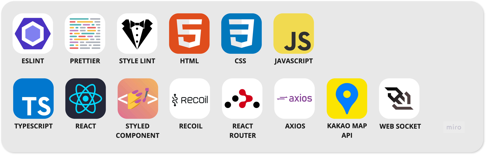
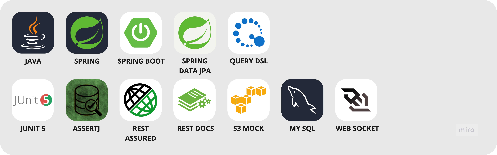
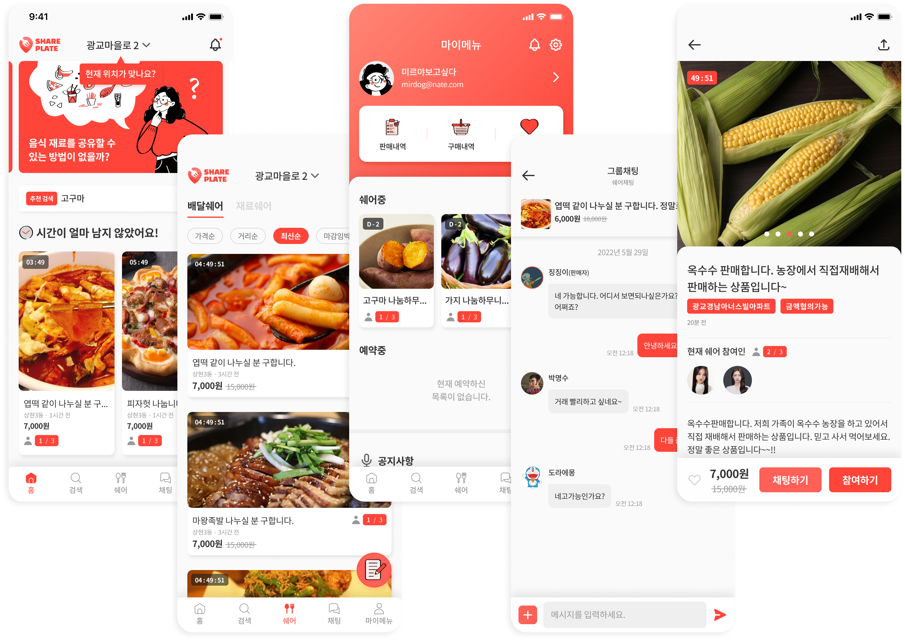

### **혼자 먹기에는 너무 많은 배달 음식**

### **혼자 사기에는 너무 많은 음식 재료**

### **[SHARE PLATE](https://d2uyt41klanc0b.cloudfront.net)로 배달음식과 재료를 다른 사람들과 나눠보세요!**

# **INTRODUCE**

2022년 현재, 1인 가구의 증가와 함께 배달 ∙ 식자재 구매 수요는 꾸준히 증가하고 있습니다.

하지만, 우리가 배달 주문하는 음식들, 요리를 위해 구매하는 재료들은 1인 가구가 감당하기에 부담스러운 가격 ∙ 양을 제공하고 있습니다.

사람들은 다른 사이트 ∙ 앱에서 재료 공구 ∙ 배달 공구와 같은 게시물들을 올리지만, 이를 적극적으로 안내해줄 플랫폼은 없었죠.

이러한 상황 속에서, 많은 사람들이 편하게 서로의 배달 음식 ∙ 음식 재료를 원하는 장소에서 나눠 가질 수 있도록 하고자, 우리는 [SHARE PLATE](https://d2uyt41klanc0b.cloudfront.net)를 만들었습니다.

### **기간**

2022.07.18 - 2022.10.31

### **LINKS**

- **[GITHUB](https://github.com/HJKL2022)**
- **[PORTFOLIO](https://gusty-art-6de.notion.site/SHARE-PLATE-71a75ce4965344f3b3a46be4fb9f9411)**
- **[NOTION](https://www.notion.so/c5352a8d177346aeb36f49e26e59cac1)**
- **[API DOCS](https://share-plate.click/docs/index.html)**
- **[SERVER(BACKEND)](http://share-plate.click)**
- **[SERVER(FRONTEND)](https://d2uyt41klanc0b.cloudfront.net/)**

# **MEMBERS**

### **BACKEND**

- **정현석(Louie)**
  [**GITHUB**](https://github.com/Louie-03)
- **한승연(Hanse)**
  [**GITHUB**](https://github.com/rkolx)

### **FRONTEND**

- **전한용(JinJeon)**
  **[GITHUB](https://github.com/JinJeon)**
  **[BLOG](https://jinjeon.github.io)**
- **한승찬(Khan)**
  **[GITHUB](https://github.com/Han-Seung-Chan)**
  **[BLOG](https://velog.io/@pon06188)**

### **DESIGN**

- **홍준표**
  [**PORTFOLIO**](https://www.notion.so/341b4d294dd34058b41ea2087476377f)

# **SKILL STACK**

### **FRONTEND**

### **BACKEND**

### **INFRA**

### **COMMON**

# **DESIGN**

# **FLOW CHART**

# **ERD**

